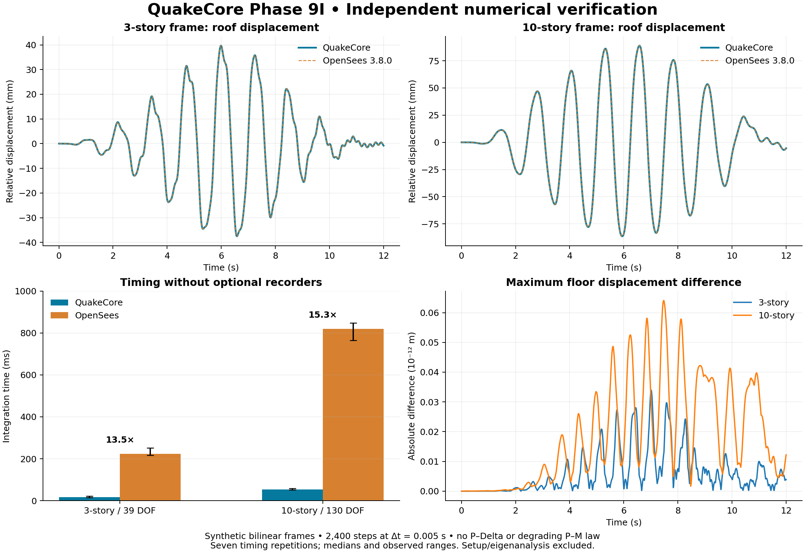
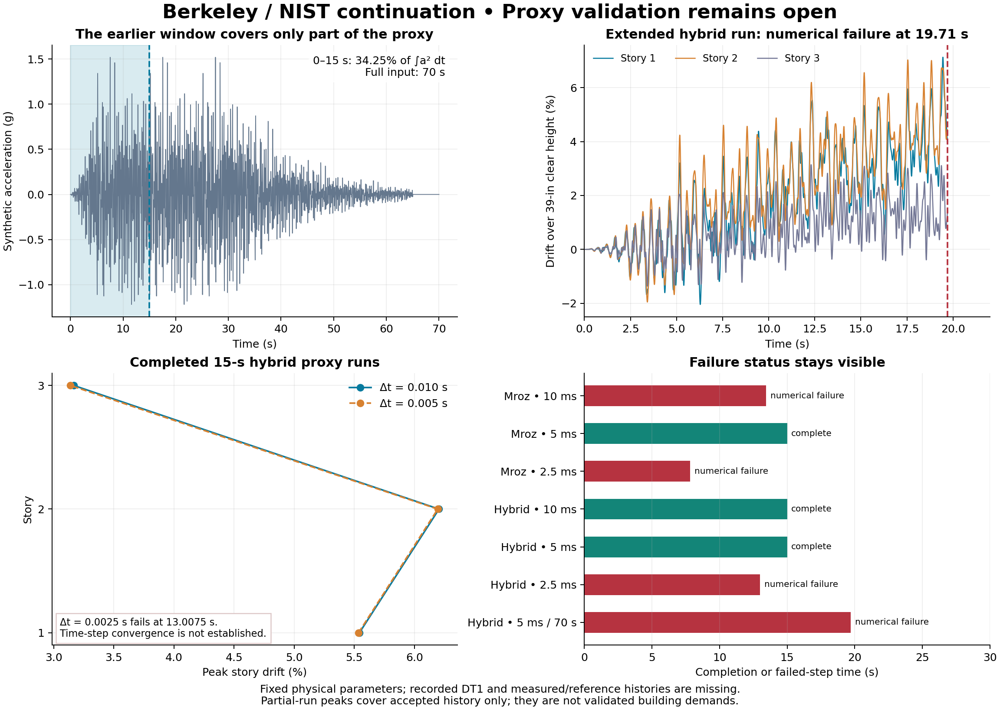

# QuakeCore Phase 9I — software audit and validation continuation

**September 8, 2026 · Research development release**

QuakeCore now has a reusable plane-frame NRHA/IDA job interface, additional numerical reliability controls, and an independently executed OpenSees comparison. The small bilinear verification frames match OpenSees essentially to floating-point precision and demonstrate more than 10× integration speedup when optional recorders are disabled. That is a useful proof of the compiled sparse/low-rank approach. It does not yet establish a commercial 3D, degrading-component speed claim or an ASCE 41-23 building assessment.

The principal engineering finding is that the Berkeley work is still a **synthetic-input study**. The supplied 1.52 g proxy is not the recorded DT1 table motion. Earlier “15 s” runs actually advanced to 15.01 s and cover only about **34.25% of the proxy's full acceleration-squared integral** (trapezoidal integration of the supplied samples). A requested 70-second continuation now reaches a numerical failure at 19.71 s. Its demands already exceed the 15-second window. Full-record completion and time-step convergence remain unresolved.

## What was inspected and reproduced

The source, results archive, patch, summary, comparison and validation note match all six supplied SHA-256 entries. The original source was retained unchanged, and the archived Phase 9F2 Mroz and Phase 9G hybrid cases were rebuilt and reproduced locally. In particular, the Mroz drift envelope is **5.08944552209 / 5.71590186748 / 2.98992992493%**, B1 plastic rotation **0.0184190647984 rad**, and B1 plastic axial deformation **0.171593618172 in**, matching the uploaded result.

Review covered the sparse/direct/low-rank solvers, Newmark drivers and state boundaries, 2D/3D compilation, P–M law, IDA scheduling/brackets, component and system tests, Berkeley builder/importer and earlier validation documentation. The source has valuable foundations: compiled constraint transformations and scatter maps, immutable topology, independently owned material state, prepared solvers, generalized low-rank updates, and a clear direct reference path. The prototype's breadth exceeds its independent validation coverage.

The original model geometry and physical parameters were retained for the new Berkeley experiments: clear-column drift height 39 in versus 48 in floor spacing, floor weights 19.6/19.6/19.3 kip, existing gravity preloads, stiffness multiplier 0.934616, existing flexure–shear settings, and the specified damping ratios. Changes were numerical integration, return mapping and diagnostics. They are not a recalibration to match the published EDPs.

## Confirmed defects and changes

| ID / priority | Finding and engineering implication | Implemented change / evidence |
|---|---|---|
| QC-01 / critical | Infinity-norm accumulation could ignore NaNs and permit a false convergence result. | Reject non-finite input, trial force/state/tangent/kinematics and corrections; regression covers direct, same-pattern and Woodbury paths. |
| QC-02 / high | A failed P–M local return threw a general exception outside the intended subdivision/recovery path. | Dedicated constitutive-integration exception, rollback/subdivision recovery and counters; programming/model errors still propagate from constitutive evaluation. |
| QC-03 / critical | EPP/Mroz predictors could accept P = 270 kip outside a 140-kip compression intercept. The capacity-floor extrapolation concealed the domain violation. | Check the axial domain, handle pure axial tips, and use complementary axial/normal-coordinate projections near singular curve endpoints. Force/state compatibility, yield-surface membership and finite-difference tangent tests pass. This fix concerns the active EPP/Mroz surfaces; post-lateral-loss gravity behavior is still a separate unvalidated model branch. |
| QC-04 / high | Mroz translation measured a Euclidean distance mixing force and moment. Changing inches to millimetres changed cyclic results after conversion back. | Normalize translation distances by axial and moment scales and scale tangent perturbations physically. The supplied cyclic unit test now differs by approximately 3.6×10⁻¹⁵ in original moment units. This does not establish Perform equivalence. |
| QC-05 / high | The axial return-equation tolerance mixed trial moment into its force scale; penalty stiffness made near-tip projection poorly conditioned. | Use an axial-force scale for the scalar equation, complementary projection coordinates, and finite/convex surface guards. Convex Perform-type projection requires alpha >= 1 and beta > 1. |
| QC-06 / high | IDA could overwrite the first threshold crossing with a later one, corrupting the bracket; unresolved failures were insufficiently distinguished. | Preserve the first upper bracket, record numerical gaps/nonmonotonic responses, validate positive scales, and return failed run status for each record. Tests exercise first-crossing and gap cases. |
| QC-07 / high | Prepared adaptive analyses could reuse final numerical factors from a preceding run while treating them as initial factors. | Invalidate the assumed tangent at the start of each legacy prepared-adaptive run; repeated nonlinear histories agree with fresh direct analyses. |
| QC-08 / high | Failed SuperLU factorization could leave allocated or stale factors. Reusing row pivots also limited robustness as stiffness changed. | Destroy partial factors on failure, refuse stale solves, allow fresh row pivots while preserving column ordering, and verify singular-refactor recovery. Leak detection itself remains unavailable in this execution environment. |
| QC-09 / high | Driver envelopes could miss peaks within accepted subdivisions. | Carry demand maxima through accepted recursive branches and discard rolled-back branches; job-level story/acceleration/hinge envelopes use accepted substeps. |
| QC-10 / medium | The old window logic added one extra sample; CSV parsing tolerated malformed/nonuniform input and silently omitted the initial sample. | Exact endpoint counting in the new runner, strict CSV/header/grid/finite checks, input hash manifest, and explicit metadata for the small omitted t=0 acceleration. A general equilibrated nonzero initial-state importer remains to be implemented. |
| QC-11 / performance | An accepted line-search evaluation was recomputed at the next Newton iteration; virgin-elastic Mroz states used unnecessary numerical tangent probes. | Reuse the accepted evaluation and return the exact elastic tangent directly. The isolated cache change reproduces the original Mroz JSON exactly. Its single exploratory timing is not used as a formal performance claim. |
| QC-12 / verification | Sanitizer compile flags were added after the core target's creation, risking uninstrumented core code; CI omitted an explicit LAPACK dependency. | Apply sanitizer flags to the core target and propagate linkage; retain the smoke benchmark and extend CI to release/instrumented builds with LAPACK. Hosted CI has not been executed here. |

The updated legacy Newmark interface rejects state-dependent or additional low-rank tangents that require the robust driver, rather than silently ignoring those contributions. The robust driver also records the last residual norm/tolerance and separately counts local, linear and non-finite failures.

## Independent OpenSees verification and performance

Two transparent 2D examples have 39 and 130 reduced DOFs, elastic members, bilinear beam-end rotational hinges and nodal masses. Both execute 2,400 steps over 12 seconds with Δt = 0.005 s. OpenSees **3.8.0** uses Steel01, transformation constraints, RCM/UmfPack, full Newton, Newmark gamma = 0.5 / beta = 0.25 and initial-stiffness Rayleigh damping **including zeroLength hinges**. Both engines use the same absolute infinity-norm tolerance and previous-displacement Newton starting guess. The OpenSees record runs through one native `analyze(n, dt)` call.

OpenSees documents Steel01 as bilinear kinematic hardening, zeroLength Rayleigh participation as optional, and NormUnbalance's max-norm option. These details matter to a matched comparison: [Steel01](https://opensees.github.io/OpenSeesDocumentation/user/manual/material/uniaxialMaterials/Steel01.html), [zeroLength](https://opensees.github.io/OpenSeesDocumentation/user/manual/model/elements/zeroLength.html), [NormUnbalance](https://opensees.github.io/OpenSeesDocumentation/user/manual/analysis/test/NormUnbalance.html).

Maximum displacement differences are **3.39×10⁻¹⁴ m** and **6.41×10⁻¹⁴ m**. Maximum drift-ratio differences are below **4.3×10⁻¹⁵**, acceleration differences below **6.3×10⁻¹² m/s²**, and the maximum relative modal-period difference across these repetitions is below **3.4×10⁻¹³**. The hinges actually yield. Their large rotation/yield-rotation ratios reflect the intentionally large elastic penalty stiffness and should not be interpreted as physical member ductility capacities.

Seven serial timing repetitions follow a recorded verification/warm-up pass. Values below are medians; all repetitions are supplied in JSON.

| Fixture / timing mode | QuakeCore (s) | OpenSees (s) | OpenSees / QuakeCore |
|---|---:|---:|---:|
| 39 DOF / integration | 0.01658 | 0.22318 | 13.46× |
| 39 DOF / recording | 0.02650 | 0.25799 | 9.73× |
| 130 DOF / integration | 0.05341 | 0.81920 | 15.34× |
| 130 DOF / recording | 0.08461 | 0.90239 | 10.67× |

Integration timing excludes model creation and modal extraction. In the no-recorder cases, QuakeCore still retains its built-in roof history, diagnostic work and energy ledger. Recording-inclusive times include OpenSees text recorders and QuakeCore EDP/JSON-history construction, but exclude the final QuakeCore JSON serialization. These are **not end-to-end product timings**. They come from one shared container with different sparse backends, small synthetic frames and no P–Delta, degrading RC/P–M, IMK or 3D equivalence test. A 13–15× result here is encouraging; the commercial target needs a declared representative workload, output requirements, accuracy gates, failed-run accounting, setup/memory measurements and controlled hardware repetitions.

## Berkeley continuation and limits

The published NIST companion paper describes an ASCE 41-17 evaluation, a one-third-scale Berkeley frame, and a 4.06× Llolleo recording with 1.52 g PGA. Those facts establish the source case, not the identity of our proxy. The public PEER page describes a 2006 experiment; the NIST summary labels the case 2008. These dates should be retained with their source meanings rather than silently treated as identical. See [NIST companion paper](https://tsapps.nist.gov/publication/get_pdf.cfm?pub_id=933227), [full report landing source](https://nvlpubs.nist.gov/nistpubs/gcr/2022/NIST.GCR.22-917-50.pdf), and [PEER test description](https://peer.berkeley.edu/shake-table-tests-nonductile-concrete-frame). The complete 56 MB report could not be fetched here; full-report target values below remain traceable to the supplied project material rather than newly digitized figures.

The supplied reference targets are measured/Perform peak drifts **5.18/6.07, 4.70/3.92 and 2.61/1.91%**, respectively, measured/Perform fundamental periods **0.34/0.48 s**, and base shears **29.8/27.9 kip**. They must not be used to “validate” a different waveform by peak matching. The new model period remains approximately **0.48006 s**.

Current results use the previous-displacement Newton guess, exact modal damping tangent where applicable, unchanged physical model parameters, and all accepted substeps for demand envelopes. `mroz_rayleigh` means the research Mroz law with the archived Rayleigh coefficients. `hybrid` means 2.5% fixed-modal plus 0.5% initial-stiffness Rayleigh damping; `modal3` is 3% fixed-modal damping. Failed-run envelopes cover only accepted history.

| Run | Base Δt (s) | Requested duration (s) | Outcome | Story 1 / 2 / 3 peak drift (%) |
|---|---:|---:|---|---|
| epp_rayleigh | 0.01 | 15 | Complete at 15 s | 5.592 / 6.215 / 3.211 |
| epp_full | 0.01 | 15 | Complete at 15 s | 5.592 / 6.215 / 3.211 |
| epp_dt2 | 0.005 | 15 | Numerical failure at 13.445 s | 5.589 / 6.230 / 3.221 |
| mroz_rayleigh | 0.01 | 15 | Numerical failure at 13.45 s | 5.443 / 6.142 / 3.183 |
| mroz_dt2 | 0.005 | 15 | Complete at 15 s | 5.440 / 6.147 / 3.188 |
| mroz_dt4 | 0.0025 | 15 | Numerical failure at 7.83 s | 3.250 / 4.575 / 2.150 |
| hybrid | 0.01 | 15 | Complete at 15 s | 5.543 / 6.205 / 3.168 |
| hybrid_dt2 | 0.005 | 15 | Complete at 15 s | 5.536 / 6.194 / 3.140 |
| hybrid_dt4 | 0.0025 | 15 | Numerical failure at 13.0075 s | 5.455 / 6.183 / 3.135 |
| modal3 | 0.01 | 15 | Numerical failure at 5.15 s | 3.160 / 2.726 / 1.813 |
| modal3_dt2 | 0.005 | 15 | Numerical failure at 5.15 s | 3.201 / 3.029 / 1.782 |
| hybrid_70s | 0.005 | 70 | Numerical failure at 19.71 s | 7.128 / 7.027 / 3.140 |

The EPP full-direct and same-pattern runs produce identical final displacements and envelopes. Hybrid 10 ms and 5 ms runs differ by less than 0.9% in their three peak drifts, but the 2.5 ms run fails. Mroz finishes at 5 ms while the 10 ms and 2.5 ms cases fail. Therefore **time-step convergence is not established**, and selecting only the successful increment would conceal a real robustness issue. Pure modal damping still fails and has not been “fixed” by changing the damping definition.

At 5 ms, the hybrid 15-second B1 plastic rotation/axial extension are approximately **0.01999 rad / 0.1863 in**. The 70-second hybrid request stops at **19.71 s**, with partial peaks **7.128 / 7.027 / 3.140%**. This exceeds the 15-second window's first- and second-story demands. The partial energy ledger error is about **0.6%**, but this endpoint diagnostic does not certify the hysteretic law or prove physical collapse. Failed cases in the final sweep are global equilibrium failures; the retained counters and residuals distinguish them from the earlier local-return problems.

CSI's own P–M theory discussion cautions that associated-flow RC hinge models can overpredict cyclic axial growth and discusses a fiber alternative. That supports investigating the existing axial-growth hypothesis; it does not prove that hypothesis from our proxy results or establish equivalence of our research Mroz implementation. [CSI P–M theory](https://web.wiki.csiamerica.com/wiki/spaces/perform/pages/1474950/Plasticity%2Btheory%2Bfor%2BP-M%2Binteraction).

## Usable software delivered

`quake_run` accepts explicit JSON models and NRHA/IDA jobs, without editing a C++ benchmark. It validates IDs, fields, basic topology/property inputs and record conventions; exposes nonlinear solver controls; produces floor histories, drift/acceleration envelopes, rotational-hinge demands and defined restoring-shear cuts; and reports partial runs explicitly. Full, summary and minimal output modes support engineering review and honest timing.

The IDA example executes two synthetic polarity variants with independently owned prepared solvers. Both return a configured 1.5% drift-threshold bracket **[2.0, 2.1810154653]** without numerical gaps. The threshold is solely a workflow demonstration, not a code acceptance criterion or physical collapse definition; the two records are not an independent hazard suite. Scale/PGA outputs are not automatically Sa(T1), and censored-data fragility inference is not implemented in the CLI.

The interface currently supports 2D elastic members and bilinear or engineer-parameterized ASCE-style rotational hinges. Existing 3D, corotational, IMK and P–M capabilities remain C++ research APIs. It reports that no gravity equilibrium analysis was performed and that code compliance is not assessed. See [job format and commands](JOB_FORMAT.md).

## Verification and remaining development

All **four CTest suites pass in Release and ASan/UBSan builds**, including the original numerical corpus, reliability regressions, P–M safety/unit/tangent checks and NRHA/IDA CLI contracts. Core compile commands confirm actual sanitizer instrumentation. LeakSanitizer cannot inspect process threads in this sandbox, so leak detection was disabled for the successful sanitizer run and **memory-leak freedom is not established**. The build/test logs and exact example inputs accompany this release.

The next engineering milestone is full-record robustness and component-law verification, followed by the recorded DT1 comparison. In particular:

1. Capture the pre-failure global/material state with complete velocity, acceleration and record position; diagnose massless-DOF equilibrium, softening-branch transitions, force/tangent consistency and local/global tolerance scaling at the failed steps. Do not classify these failures as physical collapse or change strengths to force completion.
2. Obtain recorded table acceleration, measured channel histories and the exact Perform properties/damping/gravity state. Preserve processing and similitude transformations, and compare full histories and failure mechanisms with fixed parameters.
3. Verify Mroz cyclic translation, outer-surface transition and tangents against an independent component reference. The current fixed-iteration translation and finite-difference tangent are research approximations; full 3D P–M–M and post-lateral-loss gravity behavior need separate treatment.
4. Implement gravity equilibrium and state transfer, dimensionally scaled convergence norms, documented physical-collapse criteria, and traceable edition-specific acceptance providers. ASCE's official description confirms that **ASCE 41-23 points to AISC 342 and ACI 369 and revises nonlinear analysis provisions**; the older NIST study is not a current-edition compliance certificate. [ASCE 41](https://www.asce.org/publications-and-news/codes-and-standards/asce-sei-41).
5. Profile large 3D models before GPU work. The modal branch reconstructs structural factors/low-rank workspaces per correction; modal extraction currently densifies the system; numerical constitutive and corotational tangents are expensive. Prioritize consistent component tangents, structural symbolic reuse, batched modal solves, sparse eigensolvers and record-level scheduling, then test where low-rank updates lose their advantage.

The full release-gate roadmap is in [validation protocol](VALIDATION_PROTOCOL.md). The delivered source and evidence advance a useful research engine. Building safety decisions and commercial compliance claims require the remaining independent checks above.
