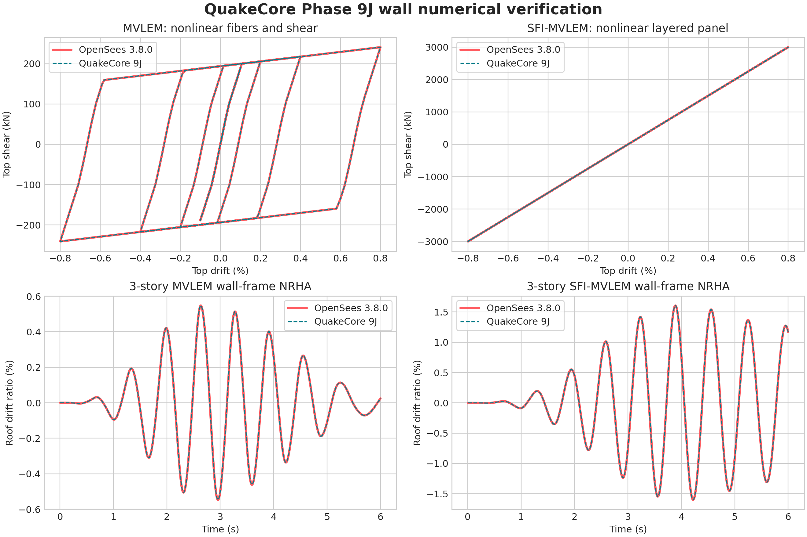

# QuakeCore Phase 9J wall implementation and verification review

**Research release: September 9, 2026**

## Decision

Phase 9J adds usable in-plane MVLEM and SFI-MVLEM element formulations to QuakeCore's compiled 2D building model. MVLEM is verified against OpenSees for the implemented elastic and nonlinear fiber/shear materials. SFI-MVLEM's six-DOF element kinematics, zero-transverse-stress panel solution, full tangent condensation, and global assembly are verified against OpenSees using elastic plane-stress and independently defined nonlinear layered panels.

The supplied `fixed_angle_rc` panel gives SFI-MVLEM a nonlinear concrete-and-steel material for integration testing. It has not been experimentally validated and is not equivalent to FSAM. QuakeCore therefore rejects the name `FSAM` and labels this material precisely in results and examples. I would be comfortable using Phase 9J to develop and verify the wall framework. I would not use the fixed-angle panel for an ASCE 41 building decision until it is replaced or supplemented by a validated RC panel model and the wall is checked against measured tests.

## What changed

- Added small-displacement two-node MVLEM and SFI-MVLEM elements with six external DOFs.
- Added fiber-level Concrete01-compatible, Steel01-compatible bilinear, and elastic uniaxial laws.
- Added isotropic, layered, and fixed-angle reinforced-concrete plane-stress panels.
- Added local transverse equilibrium (`sigma_x = 0`) and exact Schur condensation of the complete 3x3 panel tangent.
- Added transactional material history, local backtracking, recoverable constitutive failure, and global time-step subdivision compatibility.
- Added wall self-mass, frame/wall assembly, equal-DOF compatibility, Rayleigh damping, modal analysis, NRHA, and IDA support.
- Added wall history and peak response output for shear, axial force, moment, curvature, shear deformation, and fiber/panel quantities.
- Routed coupled wall tangents through exact same-pattern sparse refactorization. Scalar hinge-bank model reduction is explicitly rejected for coupled walls.
- Corrected the tangent-stability monitor to evaluate the wall at its committed material history. The former state-free call could evaluate a nonlinear wall tangent against virgin history.

## Verification evidence

All comparisons use consistent kN-m-s input and OpenSeesPy 3.8.0. The cyclic protocol contains 740 converged increments: initial axial compression followed by reversals to drift amplitudes through 0.8%. These are numerical verification fixtures, not test-calibrated wall specimens.

| Case | Max displacement difference | Max nodal-force difference | Relative force difference | Result |
|---|---:|---:|---:|---|
| MVLEM, elastic fibers/shear | 1.08e-18 m | 1.82e-12 kN | 3.13e-16 | Pass |
| MVLEM, Concrete01/Steel01/bilinear shear | 1.41e-18 m | 9.38e-13 kN | 1.30e-15 | Pass |
| SFI-MVLEM, isotropic elastic panels | 1.55e-15 m | 9.86e-9 kN | 4.49e-13 | Pass |
| SFI-MVLEM, nonlinear oriented two-layer panels | 2.95e-15 m | 9.92e-9 kN | 1.10e-12 | Pass |

Concrete01 and steel were separately exercised through 480 material increments. Stress differences from OpenSees were 2.73e-11 and 7.57e-10 in the fixture's stress units. The tangent branch at exact peak compression was aligned with OpenSees' descending-branch convention.

The fixed-angle RC panel cannot be independently assembled in the installed OpenSees binary because that binary does not expose the needed arbitrary rebar-layer material. Its accepted panel strain histories were therefore replayed through OpenSees Concrete01 and Steel01 materials. OpenSees stress replay reproduced QuakeCore panel stresses within 1.82e-11 and assembled wall nodal forces within 6.71e-12 kN over 740 steps. Maximum residual transverse stress was 1.86e-6 kPa against stress excursions of order 30,000 kPa. This verifies the implemented layer histories and force assembly at the accepted strains. It does not independently verify global equilibrium or establish FSAM behavior.

### Mechanical checks

The C++ wall suite checks:

- all three rigid-body modes produce zero resisting force;
- initial tangents are symmetric;
- analytical cantilever flexural, axial, and shear compliance;
- isotropic plane-stress condensation recovers uniaxial modulus and Poisson transverse strain;
- finite-difference agreement with elastic and nonlinear committed-state Jacobians;
- observable axial-shear coupling in the nonlinear panel;
- trial evaluation and failed local integration do not mutate committed state;
- repeat trial and rollback give identical response;
- meter-kN and millimeter-kN unit transformations give equivalent force and moment;
- wall self-mass and global frame assembly;
- state-aware tangent stability and rejection of incompatible scalar model reduction;
- full-factorization and requested-Woodbury/direct-fallback transient equivalence;
- invalid IDs, geometry, material data, unknown fields, and the unsupported `FSAM` label are rejected.

### Three-story building dynamics

A synthetic three-story wall-frame model was run for 1,200 steps at 0.005 s. OpenSees comparisons used the same node masses, wall definitions, companion elastic frames, constraints, initial-stiffness Rayleigh damping, Newmark average acceleration, and base input.

| Case | Peak drift | Max displacement difference | Max absolute-acceleration difference | Max wall-force difference |
|---|---:|---:|---:|---:|
| MVLEM nonlinear RC fibers | 0.762% | 2.41e-14 m | 4.26e-12 m/s² | 1.98e-9 kN |
| SFI-MVLEM elastic panels | 0.358% | 1.33e-14 m | 1.76e-11 m/s² | 4.07e-9 kN |
| SFI-MVLEM nonlinear two-layer panels | 2.219% | 7.42e-14 m | 2.81e-11 m/s² | 4.45e-9 kN |
| SFI-MVLEM fixed-angle RC panel | 0.653% | Internal integration only | Internal integration only | Internal integration only |

All four QuakeCore runs completed. The directly comparable first three match OpenSees throughout the response histories. Both the MVLEM RC and fixed-angle SFI wall examples also completed two-record, six-run IDA fixtures without numerical gaps; the configured 0.4% drift threshold was bracketed between scale 0.5 and 0.7071 for each synthetic polarity. Those brackets only test IDA integration. They are not physical collapse capacities.

## Defects found and resolved

1. **Committed-state stability defect.** The near-zero tangent monitor previously accepted displacement and scalar hinge tangents but no wall material state. With coupled nonlinear elements that can return the wrong tangent after cyclic history. The solver now passes committed history through the state-aware tangent method.
2. **Reduction incompatibility.** The existing reduced model assumes every nonlinear action can be evaluated as an independent scalar component. A coupled wall violates that assumption. Construction now rejects state-dependent/coupled parent models instead of silently omitting wall force changes.
3. **Concrete peak tangent convention.** At exactly peak compressive strain, QuakeCore initially returned zero slope while OpenSees selects the descending branch. The comparison caught and corrected it.
4. **SFI global-force recorder ambiguity.** The OpenSees response recorder includes Rayleigh damping in transient response, while QuakeCore wall output intentionally reports material restoring force. Dynamic verification now reads OpenSees element resisting force for a like-for-like comparison.
5. **Sparse topology risk.** Panel cracking and coupling can activate tangent entries that were initially zero. The compiler reserves the entire reduced 6x6 wall block in the CSC pattern, preventing a same-pattern refactor from losing newly active coupling terms.

## Validation status

| Claim | Status |
|---|---|
| MVLEM kinematics and element assembly | Verified against closed form and OpenSees |
| Concrete01 and bilinear steel/shear histories | Verified against OpenSees for exercised paths |
| SFI transverse equilibrium and tangent condensation | Verified analytically, by finite difference, and against elastic/layered OpenSees models |
| Coupled wall/frame NRHA | Verified against OpenSees for three defined wall laws |
| Wall IDA software path | Exercised on synthetic fixtures |
| Fixed-angle RC panel implementation | Verified by OpenSees uniaxial stress replay; no independent global reference |
| Full FSAM material | Not implemented |
| Experimental cyclic-wall prediction | Not performed |
| ASCE 41-23 / ACI 369.1-22 acceptance evaluation | Not implemented |
| Gravity and nonlinear wall stability | Not implemented |
| 3D four-node wall | Not implemented |

The PEER report describes SFI-MVLEM as an MVLEM framework populated by a fixed-strut-angle RC panel, and presents comparisons to wall and column tests. It also cautions that the assumptions of uniform shear strain, plane sections, and zero resultant transverse stress are best suited to slender or medium-rise walls, with shear-span-to-depth ratio greater than about 1.0. QuakeCore's present limits are tighter because the full validated panel law is absent. The primary source is PEER Report 2015/12: https://peer.berkeley.edu/sites/default/files/webpeer-2015-12-kristijan_kolozvari_kutay_orakcal_john_wallace.pdf

## Recommended next wall milestone

The next useful step is a faithful FSAM-compatible panel or another validated RC membrane law with explicit crack history, concrete softening, shear transfer, dowel action, and steel cyclic behavior. Validate the material first with published panel paths, then reproduce one PEER wall specimen blind at the element level. Only after that agreement should gravity state, wall geometric nonlinearity, axial/shear failure, and ASCE/ACI acceptance bookkeeping be added. This sequence lets the mechanism earn trust before it is put inside full building NRHA and IDA.
