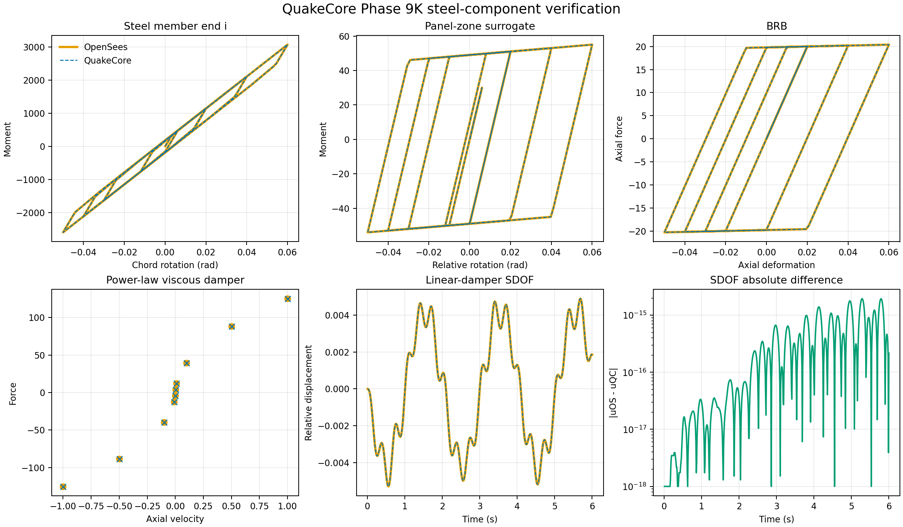

# QuakeCore Phase 9K steel-component implementation and verification review

**Research release: September 9, 2026**

## Decision

Phase 9K adds a coherent first steel-building component set: condensed-hinge steel beams and columns, a rotational panel-zone surrogate, an axial bilinear BRB, and a power-law viscous damper with a velocity-consistent Newton tangent. The defined mechanisms reproduce independent OpenSeesPy 3.8.0 reference histories to numerical precision, and an integrated steel-frame fixture exercises NRHA, nonlinear activation, time-step sensitivity, solver routing, and IDA orchestration.

This is software verification, not design validation. The current components are useful for controlled model development and solver validation. They are not yet adequate for an ASCE 41-23 or AISC 342-22 decision because gravity-state transfer, axial-flexural interaction, cyclic fracture/fatigue, section/connection limit states, code parameter providers, and physical specimen calibration are absent.

## What changed

- Added a six-external-DOF steel member with an elastic span and two local nonlinear rotational hinges.
- Added rollback-safe two-variable local Newton solution, backtracking, static condensation, and a consistent symmetric member tangent.
- Added bilinear, ASCE 41-style, and IMK-family hinge selection with mandatory provenance for degrading laws.
- Added a separately classified zero-length rotational panel-zone component.
- Added an oriented axial bilinear BRB component.
- Added a memoryless axial power-law viscous damper and its exact regularized velocity derivative.
- Extended the dynamic-model API and robust Newmark solver to assemble velocity-dependent effective tangents.
- Reserved complete steel-member and damper sparse blocks so state changes cannot introduce entries outside the compiled topology.
- Added full/summary response recorders and story-cut support for vertical steel columns.
- Aligned the bilinear tangent branch at exact yield with the reference Steel01 branch.

## Independent OpenSees comparison

The deterministic cyclic protocols contain 740 increments. The steel member is expanded in OpenSees as an elastic beam-column plus two Steel01 zero-length hinges. Panel-zone and BRB force-deformation histories use independent Steel01 material instances. The nonlinear dashpot force law is compared with OpenSees Viscous outside QuakeCore's declared regularization interval, and a linear-damper SDOF is integrated independently by both engines.

| Mechanism | Maximum absolute difference |
|---|---:|
| Steel-member end moment | 1.94e-10 |
| Steel-member hinge rotation | 1.96e-15 rad |
| Panel-zone moment/force | 6.39e-14 |
| Panel-zone tangent | 0 |
| BRB axial force | 3.38e-14 |
| BRB tangent | 0 |
| Nonlinear power-law damper force | 7.11e-15 |
| Linear-damper SDOF displacement | 1.94e-15 |
| Linear-damper SDOF velocity | 2.85e-14 |

All comparisons passed their deterministic tolerances. These results show parity for the equations and paths that were defined. They do not validate an AISC panel-zone idealization, BRB qualification behavior, manufacturer damper model, or physical steel-frame response.

## Integrated system checks

The integrated one-story fixture includes two columns, one beam, a panel-zone spring, a BRB, and a sublinear viscous damper. A stronger synthetic protocol was used for verification so every nonlinear component was activated.

| Check | Result |
|---|---:|
| Full versus requested-Woodbury maximum displacement difference | 0 |
| Full versus requested-Woodbury maximum drift difference | 0 |
| Peak drift at `dt` | 1.6137% |
| Peak drift at `dt/2` | 1.5948% |
| Relative peak-drift change | 1.19% |
| BRB yielded | Yes |
| Panel zone yielded | Yes |
| Column hinge yielded | Yes |
| Peak damper force | 357.738 |

The requested Woodbury result equals the full result because coupled steel-member and velocity-dependent tangents deliberately use exact same-pattern sparse refactorization. No steel speedup is claimed for this path yet.

A six-run synthetic IDA exercise bracketed a configured 2% drift threshold between scale 100 and 118.9207 with no numerical gap, numerical failure, or nonmonotonic flag. That threshold only verifies orchestration and termination bookkeeping; it is not a physical-collapse capacity.

## Mechanical and contract tests

The C++ and JSON suites cover invalid inputs, rigid-body response, initial-tangent symmetry, nonlinear and elastic finite-difference tangents, state rollback, the rigid-hinge elastic-frame limit, panel-zone and BRB kinematics/classification, sublinear damper regularization, velocity tangent, a linear-damper equivalence check, direct/fallback response equality, provenance requirements, and malformed topology. The complete Release suite contains eight passing test targets.

## Defects found and resolved

1. **Exact-yield tangent branch.** The existing bilinear spring selected the elastic tangent when the return-mapping yield function was exactly zero. The OpenSees comparison exposed the boundary convention; QuakeCore now selects the post-yield consistent tangent at exact yield.
2. **Legacy hinge compatibility.** An early panel-zone topology check inadvertently required coincident nodes for every legacy C++ rotational spring. The check is now limited to the dedicated panel-zone JSON component, preserving the existing generalized hinge API.
3. **Velocity-tangent omission.** The original dynamic-model interface could return only displacement-dependent tangent changes. The new velocity-aware effective-tangent method makes damper Newton iterations consistent rather than treating a nonlinear velocity force as a fixed residual correction.
4. **Sparse-pattern completeness.** Condensed steel hinges can change all terms in a member's external bending block. The compiler now reserves the complete reduced member block before factorization.

## Validation status

| Claim | Status |
|---|---|
| Steel-member hinge condensation and tangent | Verified analytically, by finite difference, and against expanded OpenSees model |
| Bilinear panel-zone and BRB histories | Verified against OpenSees Steel01 for exercised paths |
| Power-law viscous force and velocity tangent | Verified analytically and against OpenSees Viscous away from regularization interval |
| Linear viscous SDOF transient | Verified against OpenSees history |
| Integrated NRHA and IDA software paths | Exercised on synthetic fixtures |
| ASCE 41-style / IMK-family steel-hinge external parity | Not established by Phase 9K |
| Steel member axial yielding/P-M interaction | Not implemented |
| Panel-zone geometry/AISC property derivation | Not implemented |
| BRB fatigue, fracture, qualification limits | Not implemented |
| Maxwell/relief-valve/manufacturer damper behavior | Not implemented |
| Physical component or full-building validation | Not performed |
| ASCE 41-23 / AISC 342-22 acceptance evaluation | Not implemented |

## Recommended next component milestone

Proceed with soil/foundation components as a separate Phase 9L. First implement a general rollback-safe zero-length soil spring/dashpot with gap, uplift/compression-only behavior, and explicit backbone provenance. Then add p-y, t-z, and q-z adapters with tributary-length conversion. Finally compile piles as existing beam-column meshes with depth-wise local soil springs and recorders. Validate each layer against closed forms and OpenSees before adding pile groups, liquefaction, or kinematic soil-structure interaction.
